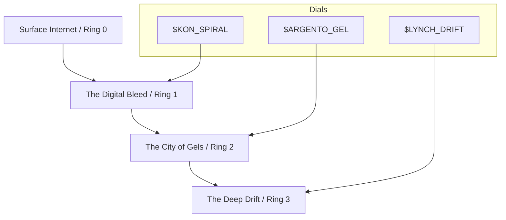

# CHTHON-ONEIROS

  
  
  

---

## 👁️ Overview
**CHTHON-ONEIROS** is a psychological horror narrative engine and theory corpus. It is the "Underworld" counterpart to the waking reality of Field I, exploring **horror as epistemology**—not as genre decoration, but as a mode of understanding the limits of human knowledge.

The project is housed within the **PHANTASMATA** container, a registry of altered states, recursion, and reality failure.

---

## 🗺️ Navigation
- [**Bible**](./bible/): The governing laws of physics, geography, and entities.
- [**Research**](./research/): Deep dives into 20+ horror masters and thematic clusters.
- [**Production**](./production/): Active episodes and high-intensity synthesis.
- [**Release**](./release/): Canonical campaign history (Season 1 & 2).
- [**The Trapdoor**](./bible/geography.md): *Descent into the Substrate (Ring 4).*
- [**Docs**](./docs/): Theoretical foundations and strategy archives.

---

## ⚙️ The Three Dials
Reality in CHTHON-ONEIROS is modulated by three aesthetic axes:

| Dial | Focus | Reference |
|---|---|---|
| **$ARGENTO_GEL** | Color as weapon, ritual staging, operatic violence. | *Suspiria*, *Deep Red* |
| **$LYNCH_DRIFT** | Mundane-to-cosmic dread, dream logic, identity blur. | *Mulholland Drive*, *Twin Peaks* |
| **$KON_SPIRAL** | Mediation collapse, recursion, the image as predator. | *Perfect Blue*, *Paprika* |

---

## 🏗️ Architecture

---

## 📜 The Conservation Law
> **"No work may remain in a field where it no longer resists me."**

When the work stops pushing back, it no longer belongs here. Resistance is the metric of life.

---

## 🚀 Quick Start
1.  Read the [**Catalog**](./CATALOG.md) to understand the current corpus.
2.  Consult the [**Bible**](./bible/physics.md) before contributing.
3.  Use the [**Dial Worksheet**](./drafts/DIAL-WORKSHEET.md) to calibrate your fragments.

---

  <i>"Horror is the affect that accompanies epistemic failure."</i>

